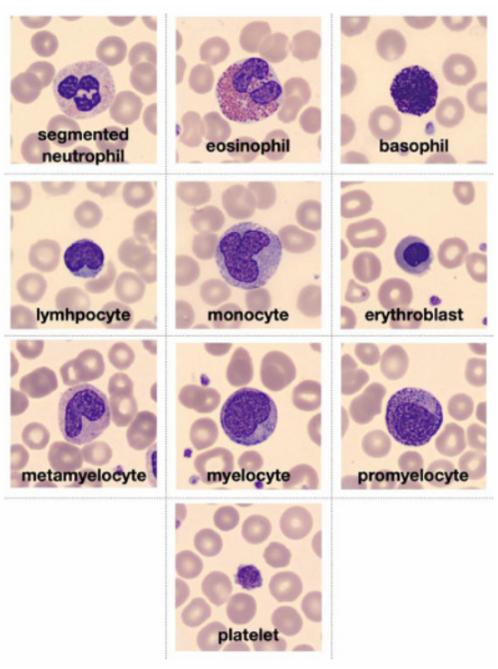

# WBC Classification using CNN

This project implements a Convolutional Neural Network (CNN) to classify white blood cells (WBCs) from microscopic images into 8 distinct classes. The model is trained and validated using stratified 5-fold cross-validation and a weighted random sampler. It supports single/batch inference. All modules conform to an interface-based grading system.

## Data Summary and Split

The full dataset is organised into two parts:

- `data/`: Contains 10 representative images per WBC class for visual reference.
- `actual_training_testing_data/`: Contains the full processed dataset divided into `Training/` and `Testing/` folders, each containing subfolders for the 8 WBC classes.

The training set merges original training and validation splits extracted from the `.npz` file, using a renaming scheme to prevent filename collisions.

Training Pipeline Highlights:

- **Stratified 5-Fold Cross-Validation** for robust generalization.
- **Weighted Random Sampler** to address class imbalance in each fold.
- **Data Augmentation** (horizontal/vertical flips, rotations).
- **Best Fold Selection** is based on the highest validation ROC AUC.

---

## Model Architecture and Rationale

A custom Convolutional Neural Network (CNN) was designed for this task due to its suitability in processing spatial hierarchies in images. The model accepts 3-channel RGB images of dimension 224x224 and passes them through:

- 4 Convolutional Blocks: each consisting of `Conv2D -> BatchNorm -> ReLU -> MaxPooling`
- 2 Fully Connected (Dense) Layers: with dropout and batch normalisation
- Final Output Layer: with 8 neurons (one per WBC class) and softmax activation

The CNN architecture is highly effective for WBC morphology classification because it can learn and extract key morphological features that define each cell type. The distinct characteristics of each white blood cell (WBC) type are captured as follows:
- Basophils: Irregularly shaped cells with large blue/purple granules.
- Eosinophils: Bi-lobed nucleus and distinctive cytoplasmic granules.
- Erythroblasts: Large, round nucleus with dense cytoplasm, precursor to red blood cells.
- Immature Granulocytes (IG): Grouped from promyelocytes, myelocytes, and metamyelocytes, characterised by immature, irregular nuclear shapes.
- Lymphocytes: Large, round nucleus with sparse cytoplasm.
- Monocytes: Kidney-shaped nucleus and abundant cytoplasm.
- Neutrophils: Multi-lobed nucleus with a granular cytoplasm.
- Thrombocytes: Small, irregular cell fragments without a nucleus.

Why CNNs?
- Local Feature Extraction: CNNs automatically detect cell boundaries, nuclear shapes, and granular features.
- Translation Invariance: Capable of identifying WBCs regardless of their position in the image.
- Hierarchical Learning: Extract low-level features (edges, contours) in early layers and more complex features (nuclear structure, cytoplasm) in deeper layers.

Thus, CNNs are ideal for identifying subtle morphological differences across WBC types, making them highly effective for automating blood cell classification.
---

## Project Overview

### Problem Description

Manual identification of blood cells from microscopic images is time-consuming and prone to error. Automating this task using deep learning can assist medical professionals in diagnosing haematological disorders more efficiently.

This project develops a CNN-based classifier to identify eight types of white blood cells:

- Basophil
- Eosinophil
- Erythroblast
- Immature Granulocyte
- Lymphocyte
- Monocyte
- Neutrophil
- Thrombocyte

### Input/Output

- **Input**: RGB image of a blood cell (224x224)
- **Output**: Predicted class label (one of the eight types)

---

## Dataset Preparation

### Cell Type Overview

Below is a visual overview of different blood cell types used in classification:



*Figure: Representative White Blood Cell Types (Basophil, Eosinophil, Erythroblast, etc.)*

Note:
- **Promyelocyte**, **Myelocyte**, and **Metamyelocyte** classes have been grouped into a single category: `Immature_granulocyte`

### Dataset Description

- **Original Split**: 70% training, 10% validation and 20% testing; However, for stratified 5-fold CV, the training and validation folders have been merged
- **Training Set Size**: 13,671 images (merged original train and val)
- **Testing Set Size**: 3,421 images
- **Image Size**: Resized to 224x224 pixels
- **Preprocessing**:
  - RGB images are normalised channel-wise
  - Pixel values are standardized using mean=0.5 and std=0.5 across all 3 channels
  - Data Augmentation techniques, including Random Horizontal Flip, Random Vertical Flip, and Random Rotation, are applied to increase the variability of training 
    data. This helps the model become invariant to different orientations of the cells, as cells may appear differently due to varying imaging conditions or 
    sample preparation. These augmentations help the model generalise better, reducing overfitting by teaching the network to focus on the intrinsic features of 
    the cells, rather than their specific positioning or orientation.


### Source

- Dataset: BloodMNIST - [https://zenodo.org/records/10519652]
- Paper: [https://www.sciencedirect.com/science/article/pii/S2352340920303681]

### Image Extraction from `.npz`

#### Script 1: Extract and Save Images

```python
import numpy as np
import os
import cv2
from collections import defaultdict

data = np.load("bloodmnist_224.npz")
train_images, train_labels = data["train_images"], data["train_labels"]
val_images, val_labels = data["val_images"], data["val_labels"]
test_images, test_labels = data["test_images"], data["test_labels"]

def save_images(images, labels, folder_name):
    os.makedirs(folder_name, exist_ok=True)
    class_counts = defaultdict(int)

    for img, label in zip(images, labels):
        label_idx = int(label[0])
        class_folder = os.path.join(folder_name, str(label_idx))
        os.makedirs(class_folder, exist_ok=True)

        class_counts[label_idx] += 1
        img_filename = f"{class_counts[label_idx]}.png"
        img_path = os.path.join(class_folder, img_filename)

        img_bgr = cv2.cvtColor(img, cv2.COLOR_RGB2BGR) if img.shape[2] == 3 else img
        cv2.imwrite(img_path, img_bgr)

save_images(train_images, train_labels, "Training")
save_images(val_images, val_labels, "Validation")
save_images(test_images, test_labels, "Testing")
```

#### Script 2: Rename Validation Images

Note: This was done to combine the validation and training images into one "Training" folder and perform 5-fold CV with weighted random sampling. The indices for renaming start one index after each last respective training image of the WBC cell type, so that there is no duplicate naming in the combined "Training" folder.

```python
import os

VAL_PATH = "Validation"
start_indices = {
    "Basophil": 853,
    "Eosinophil": 2182,
    "Erythroblast": 1086,
    "Immature_granulocyte": 2027,
    "Lymphocyte": 850,
    "Monocyte": 994,
    "Neutrophil": 2331,
    "Thrombocyte": 1644
}

for class_folder in os.listdir(VAL_PATH):
    class_path = os.path.join(VAL_PATH, class_folder)
    if not os.path.isdir(class_path) or class_folder not in start_indices:
        continue

    prefix = class_folder[:2]
    start_num = start_indices[class_folder]
    for i, filename in enumerate(sorted(os.listdir(class_path))):
        old_path = os.path.join(class_path, filename)
        new_path = os.path.join(class_path, f"{prefix}_{start_num + i}.png")
        os.rename(old_path, new_path)
```

### Label Mapping

```
0 - Basophil
1 - Eosinophil
2 - Erythroblast
3 - Immature_granulocyte
4 - Lymphocyte
5 - Monocyte
6 - Neutrophil
7 - Thrombocyte
```

---

## Folder Structure

Note: The 'outputs\' folder will be created as part of the code implementation. This just shows how the final structure would be.

```
project_root/
├── data/                            # 10 sample images per class
│   ├── Basophil/
│   ├── Eosinophil/
│   ├── Erythroblast/
│   ├── Immature_granulocyte/
│   ├── Lymphocyte/
│   ├── Monocyte/
│   ├── Neutrophil/
│   └── Thrombocyte/
│
├── actual_training_testing_data/   # Full dataset with all training/testing images
│   ├── Training/                    # 8 subfolders (1 per class)
│   └── Testing/                     # 8 subfolders (1 per class)
│
├── dataset.py                      # Data loading and augmentation logic along with weighted random sampler
├── model.py                        # WBC_Classifier_CNN model definition
├── train.py                        # Training loop (5-fold CV, AUC-based model saving)
├── predict.py                      # Single/batch inference and test set evaluation
├── config.py                       # Device, batch size, epochs, image dims
├── interface.py                    # Required interface imports for grading
│
├── checkpoints/                    # Best model per fold, also has a gitkeep file (only as a placeholder for tracking by Git during pulling/cloning/pushing)
│   ├── best_model_fold1.pt
│   ├── best_model_fold2.pt
│   └── ...
│
├── outputs/                        # Store text files and plots for evaluation, also has a gitkeep file (only as a placeholder for tracking by Git during pulling/cloning/pushing)
│   ├── training_metrics/
│   │   ├── foldwise_val_roc_auc_plot.png
│   │   ├── best_fold_accuracy_loss.png
│   │   └── fold_metrics.npy
│   ├── prediction_metrics/
│   │   ├── test_metrics.txt
│   │   ├── test_metrics.npy
│   │   └── confusion_matrix.png
```

---

## Installation

```bash
pip install torch torchvision numpy matplotlib seaborn scikit-learn
```

---

## Configuration (config.py)

| Variable       | Description                | Default |
| -------------- | -------------------------- | ------- |
| batch_size     | Training batch size        | 32      |
| epochs         | Epochs per fold            | 10      |
| learning_rate  | Optimizer learning rate    | 0.001   |
| resize_x / y   | Image resizing dimensions  | 224     |
| num_classes    | Number of output classes   | 8       |
| device         | cuda / mps / cpu auto-pick | Auto    |

---

## Training

```python
from interface import the_trainer

the_trainer(data_dir="actual_training_testing_data")
```

- Trains with 5-fold stratified CV
- Uses a weighted random sampler
- Tracks and plots fold-wise metrics
- Saves the best model checkpoint for each fold

---

## Inference

```python
from interface import the_predictor
preds, probs = the_predictor(input_tensor)
```

- Accepts single image or batch of shape [C, H ,W] or [B, C ,H ,W]
- Returns predicted classes and softmax scores

---

## Test Set Evaluation

```python
from predict import predict_model
predict_model(data_dir="actual_training_testing_data")
```

- Loads the best model fold
- Evaluates on the full test set
- Saves `.txt` and `.npy` metrics and confusion matrix image

---

## Developer

Rishabh Kulkarni, 4th Year, BS-MS IISER Pune

---

## References

- BloodMNIST Dataset: [https://zenodo.org/records/10519652]
- Original Paper: [https://www.sciencedirect.com/science/article/pii/S2352340920303681]
- OpenAI
